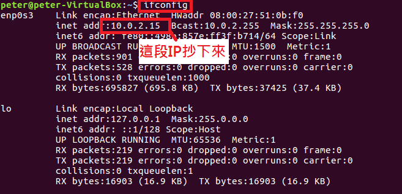
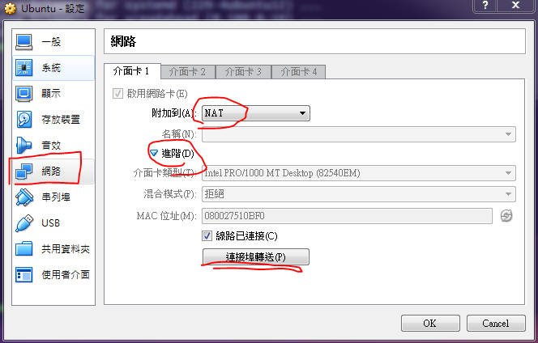
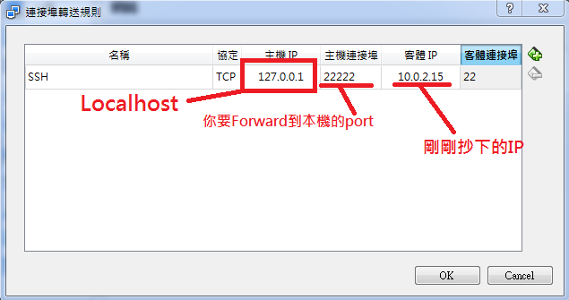
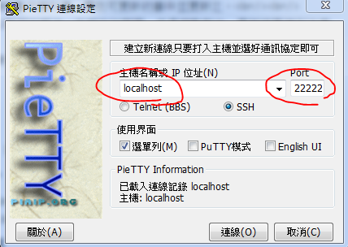

# 第三章：安裝好系統後的第一步
## 對於Ubuntu 16.04 黑屏的問題
這是個奇怪的問題，因為重開幾次VirtualBox 這個問題會自動消失，可能要等VirtualBox 更新，也許就會修復了。
## 關於apt-get 小知識：
Ubuntu 與Debian類似，使用 apt-get 來下載、管理、更新套件(Package)。這些套件是人們在特定的系統版本下，將相容當前系統版本的二元檔或原始碼，打包成的套件。套件裡面含有重要的Dependency 信息，可以讓Linux 底下的套件管理程式做統一的管理，減少相依性造成的各種問題，提供可靠的相容性。Ubuntu 與Debian 使用的主要套件管理程式為dpkg ，有興趣可以上網搜尋、了解，在本單元中不做進一步解釋。
## 開啟終端機模擬器：
在最近的版本中，除了在左上角的Panel 搜尋"Terminal" 以外，還可以使用快捷鍵： <br/><br/>
```Ctrl+Alt+T```<br/><br/>
就可以開啟終端機模擬器。雖然對於很多初學者來說，純文字介面非常不人性化，但這是以後使用Linux 很重要的功能。
## 更新套件源：
剛裝好系統，**先做一次套件更新**是很重要的，可以解決很多相依性或相容性問題。   <br/><br/>
```sudo apt-get update``` <br/>可以同步套件資料庫，使本機與遠端repository 同步，讓電腦了解是否有需要更新的套件。 <br/><br/>
```sudo apt-get upgrade``` <br/>根據本機的套件資料庫，尋找可更新的套件並更新之。<br/><br/>
```sudo apt-get dist-upgrade```<br/>可以聰明地解決一些相依性問題，但是變動較大，更新時要特別注意它會改些什麼。不建議新手使用。<br/><br/>
關於sudo，簡單來說，使用sudo 即是使用管理員權限執行某些指令，所以當它要求輸入密碼時，盲打後按下Enter 即可。
## 搜尋套件：
在文字介面中，<br/><br/>
```sudo apt-cache search```<br/><br/>
可以搜尋特定名稱的套件，可以結合```grep``` 對結果做進一步篩選。
## (Optional)安裝SSH，方便日後登入、傳檔案，免架FTP、免安裝VirtualBox Guest Tools
取得 SSH套件:<br/><br/>```sudo apt-get install ssh```<br/><br/>
安裝好後，之後系統開機，會自動啟動SSH 服務(daemon)，我們可以對VirtualBox 做一些設定。(Tricks)
### 設定NAT port forwarding 
#### 1. 設定轉送



#### 2. WHOA-LA!!!



